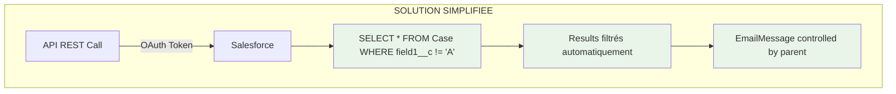
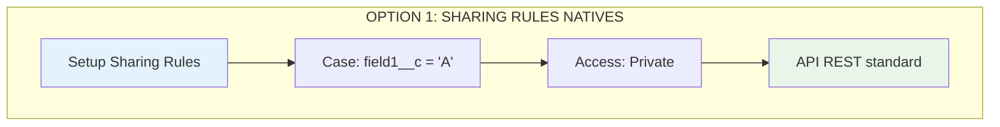
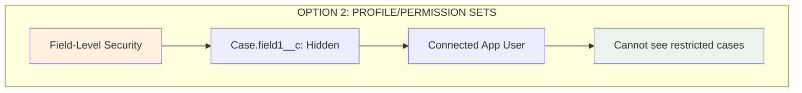
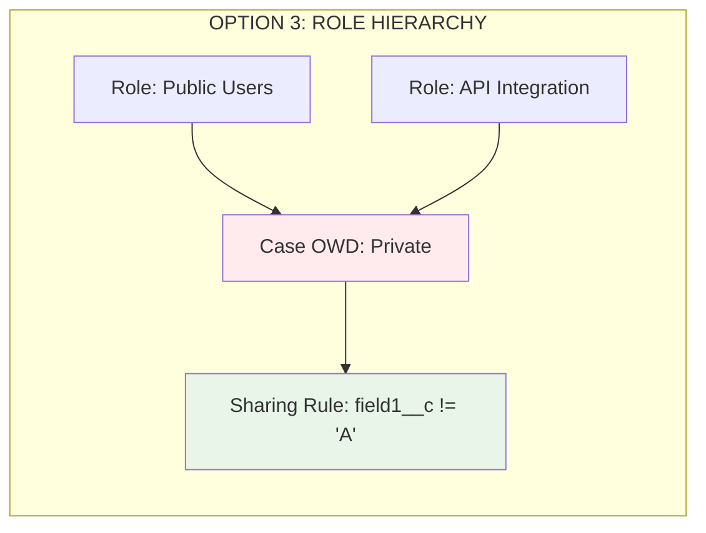
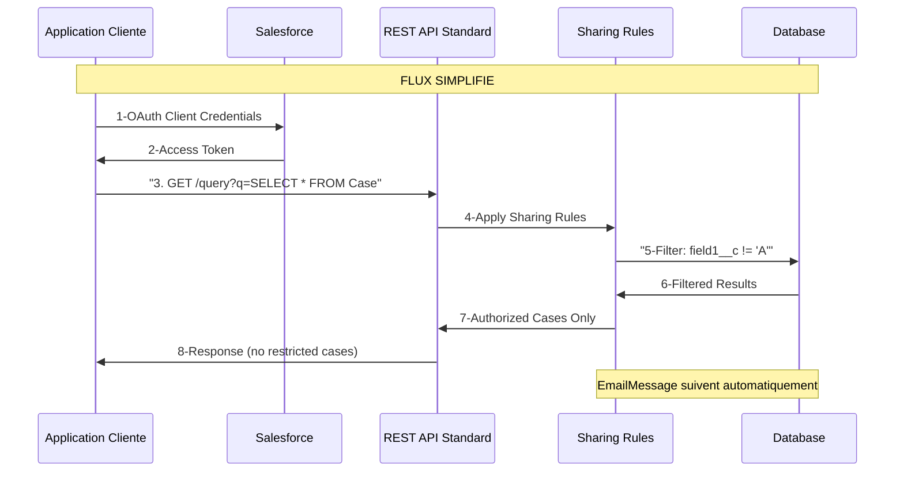

Ah excellent ! Cette modification de spécification **simplifie énormément** la solution ! 🎯

Exactement ! Vous avez tout à fait raison. C'est **beaucoup plus élégant** et **direct** ! 🎯

## **Architecture finale simplifiée**

### **1. Organization-Wide Defaults**
```
Setup → Security → Sharing Settings → Organization-Wide Defaults
- Case: Private (bloc tout par défaut)
```

### **2. Public Group + Sharing Rule**
```
Setup → Public Groups → New
- Name: "API Integration Users"  
- Type: Public Group
- Members: integration.api@company.com, crm.integration@company.com, etc.

Setup → Case Sharing Rules → New
- Rule Name: "API Access - Unrestricted Cases"
- Criteria: Case.field1__c NOT EQUAL TO "A"
- Share with: Public Group "API Integration Users"
- Access: Read Only
```

### **3. Connected App (inchangée)**
```
Connected Apps → [Votre App] → Client Credentials Flow
- Run As: integration.api@company.com (membre du Public Group)
```

## **Flow simplifié**

```mermaid
graph LR
    A[Connected App] -->|Run As| B[integration.api@company.com]
    B -->|Member of| C[Public Group: API Integration Users]
    C -->|Sharing Rule| D[Access to Cases where field1__c != 'A']
    D -->|Controlled by Parent| E[Access to EmailMessage enfants]
```

## **Plus besoin de :**

❌ ~~Permission Sets custom~~  
❌ ~~Triggers EmailMessage~~  
❌ ~~TriggerHandler~~  
❌ ~~EmailMessageSharingService~~  
❌ ~~Custom Permissions~~  
❌ ~~Code Apex complexe~~  

## **Juste besoin de :**

✅ **OWD Case = Private**  
✅ **Public Group avec les utilisateurs techniques**  
✅ **1 Sharing Rule basée sur `Case.field1__c`**  
✅ **Connected App standard**  

## **Test direct**

```bash
# L'endpoint REST standard fonctionne immédiatement
curl -H "Authorization: Bearer TOKEN" \
"https://instance.salesforce.com/services/data/v58.0/query/?q=SELECT+Id,Subject,field1__c+FROM+Case"

# Retournera automatiquement SEULEMENT les Cases avec field1__c != 'A'
# Les EmailMessage suivent par héritage (controlled by parent)
```

Vous avez raison - les **Sharing Rules avec Public Groups** sont la solution native parfaite pour ce cas ! C'est la puissance de Salesforce quand on peut utiliser les fonctionnalités standard plutôt que du code custom. 🚀

Beaucoup plus **maintenable**, **performant** et **simple** !








## **Avec le champ sur Case (parent) :**

### ✅ **Solutions natives Salesforce possibles**

**1. Sharing Rules standard** (le plus simple)
```
Setup → Security → Sharing Settings → Case Sharing Rules

Rule Name: "Restrict Cases with field1__c = A"
Based on: Case
Criteria: Case.field1__c EQUALS "A"  
Access: Private (No access)
```

**2. SOQL direct dans l'API REST**
```sql
-- Requête filtrée directement
SELECT Id, Subject FROM Case WHERE field1__c != 'A'

-- Les EmailMessage suivent automatiquement (controlled by parent)
SELECT Id, (SELECT Id FROM EmailMessages) FROM Case WHERE field1__c != 'A'
```

## **Comparaison : Avant vs Après**

| Aspect | **Avant (EmailMessage.field1__c)** | **Après (Case.field1__c)** |
|--------|-----------------------------------|----------------------------|
| **Complexité** | ❌ Trigger + Service complexe | ✅ Configuration native |
| **Performance** | ❌ Trigger sur chaque EmailMessage | ✅ Evaluation directe |
| **Maintenance** | ❌ Code custom à maintenir | ✅ Configuration standard |
| **API REST** | ❌ Pas de filtrage direct | ✅ Filtrage SOQL natif |
| **Temps réel** | ❌ Async via @future | ✅ Immédiat |

## **Architecture simplifiée**## **Recommandation : Option 1 - Sharing Rules**

```
Setup → Security → Sharing Settings → Organization-Wide Defaults
- Case: Private

Setup → Case Sharing Rules → New Rule
- Rule Name: "API Access - Unrestricted Cases"
- Based on: Case
- Criteria: Case.field1__c NOT EQUAL TO "A"
- Share with: Public Group "API Integration Users"
- Access Level: Read Only
```

## **Avantages de cette simplification**

✅ **Zero code** - Configuration pure Salesforce  
✅ **Performance native** - Pas de trigger overhead  
✅ **API REST standard** - Endpoint `/query` fonctionne directement  
✅ **Temps réel** - Pas d'async, filtrage immédiat  
✅ **Audit natif** - Setup Audit Trail  
✅ **Rollback facile** - Juste désactiver la Sharing Rule  

## **Migration depuis votre solution actuelle**

```apex
// 1. Supprimer les triggers
// 2. Supprimer les Permission Sets custom
// 3. Configurer les Sharing Rules
// 4. Tester l'API REST directement

// Test simple
curl -H "Authorization: Bearer TOKEN" \
"https://instance.salesforce.com/services/data/v58.0/query/?q=SELECT+Id+FROM+Case"
// Devrait automatiquement exclure les Cases avec field1__c = 'A'
```

Cette nouvelle spécification transforme un **problème architectural complexe** en **configuration standard** ! 🎉

Voulez-vous que je détaille l'une des options de configuration ?
