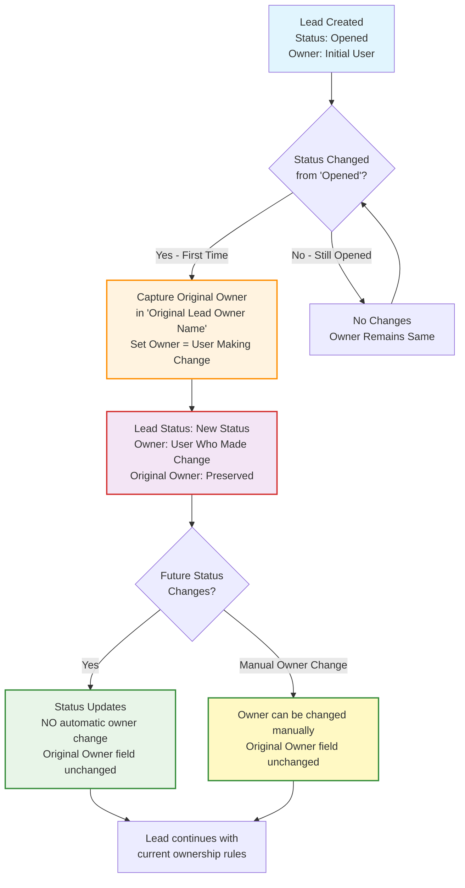

```mermaid
flowchart TD
    A[Lead Created<br/>Status: Opened<br/>Owner: Initial User] --> B{Status Changed<br/>from 'Opened'?}
    
    B -->|Yes - First Time| C[Capture Original Owner<br/>in 'Original Lead Owner Name'<br/>Set Owner = User Making Change]
    
    B -->|No - Still Opened| D[No Changes<br/>Owner Remains Same]
    
    C --> E[Lead Status: New Status<br/>Owner: User Who Made Change<br/>Original Owner: Preserved]
    
    E --> F{Future Status<br/>Changes?}
    
    F -->|Yes| G[Status Updates<br/>NO automatic owner change<br/>Original Owner field unchanged]
    
    F -->|Manual Owner Change| H[Owner can be changed manually<br/>Original Owner field unchanged]
    
    G --> I[Lead continues with<br/>current ownership rules]
    H --> I
    
    D --> B
    
    style A fill:#e1f5fe
    style C fill:#fff3e0
    style E fill:#f3e5f5
    style G fill:#e8f5e8
    style H fill:#fff9c4
    
    classDef automaticProcess fill:#ffecb3,stroke:#ff8f00,stroke-width:2px
    classDef oneTimeOnly fill:#ffcdd2,stroke:#d32f2f,stroke-width:2px
    classDef preserved fill:#c8e6c9,stroke:#388e3c,stroke-width:2px
    
    class C automaticProcess
    class E oneTimeOnly
    class G,H preserved
```
